# MeetingNote

> 회의가 끝나면 정리가 끝나 있게. 「그때 뭐라고 했더라」가 사라지게.

녹취 파일을 올리거나 메모를 붙여 넣으면 **요약 · 결정사항 · 할 일** 세 갈래로 자동 정리해 주는 회의록 웹 앱입니다.
받아쓰기와 정리는 Gemini API(`gemini-3.1-flash-lite`)가 맡습니다.


<p align="center">
  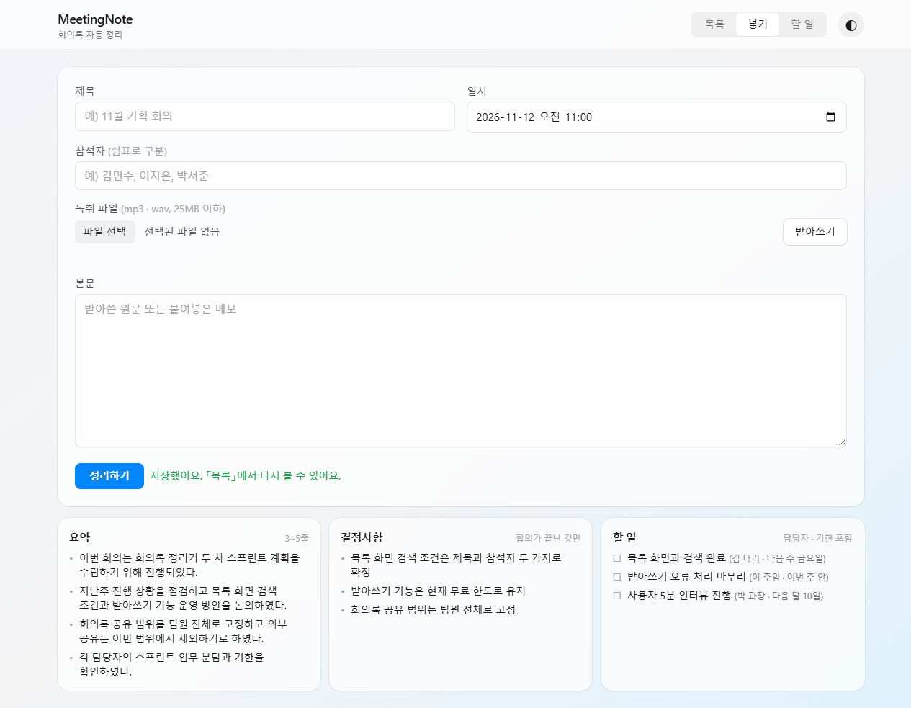
</p>

---

## 목차

- [주요 기능](#주요-기능)
- [화면 둘러보기](#화면-둘러보기)
- [구조](#구조)
- [동작 흐름 (시퀀스)](#동작-흐름-시퀀스)
- [데이터 모델](#데이터-모델)
- [REST API](#rest-api)
- [빠른 시작](#빠른-시작)
- [테스트](#테스트)
- [폴더 구조](#폴더-구조)
- [문서](#문서)

---

## 주요 기능

| 기능 | 설명 |
|---|---|
| 🎙️ **받아쓰기** | mp3 · wav (25MB 이하) 녹취 파일을 올리면 본문이 채워집니다 |
| 🧠 **세 갈래 정리** | 요약(3~5줄) · 결정사항(합의가 끝난 것만) · 할 일(담당자 · 기한)로 나눕니다. 잡담은 버립니다 |
| 🗂️ **회의록 CRUD** | 추가 · 목록 · 수정 · 삭제를 모두 화면에서 합니다 |
| 🔍 **검색** | 제목 · 참석자 부분 일치, 날짜 범위(로컬 날짜 기준) |
| ✅ **할 일 모아 보기** | 여러 회의의 할 일을 담당자 · 기한과 함께 한 표로 봅니다 |
| 🌗 **라이트 / 다크** | 처음엔 시스템 설정을 따르고, 고른 테마는 새로고침해도 남습니다 |
| 📱 **반응형** | 360px 모바일에서도 깨지지 않습니다 |

---

## 화면 둘러보기

### 1. 넣기 - 녹취 받아쓰기 → 정리하기

| 받아쓰는 중 | 받아쓰기 완료 |
|---|---|
|  | 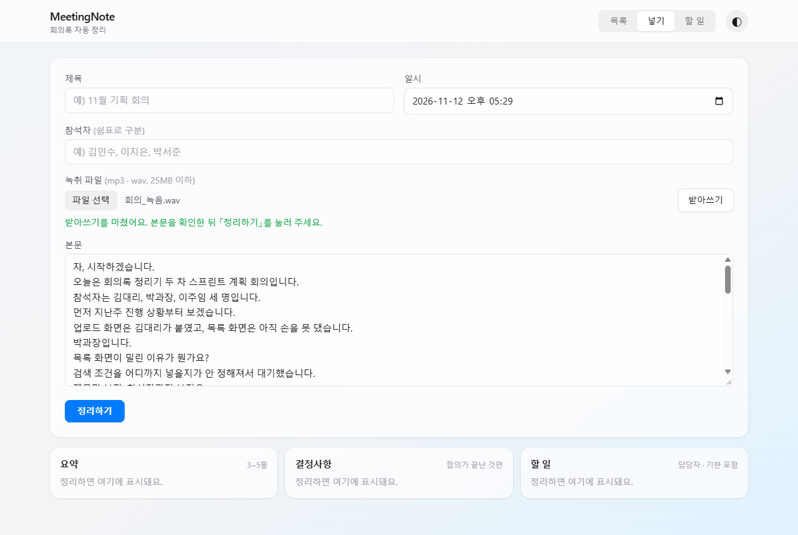 |

| 세 갈래 정리 결과 | 짧은 메모 → 구분 실패 안내 |
|---|---|
|  | 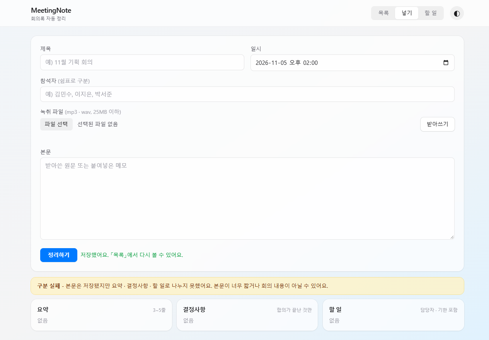 |

### 2. 목록 · 검색

| 카드 목록 (2열) | 제목 · 참석자 검색 | 날짜 검색 |
|---|---|---|
| 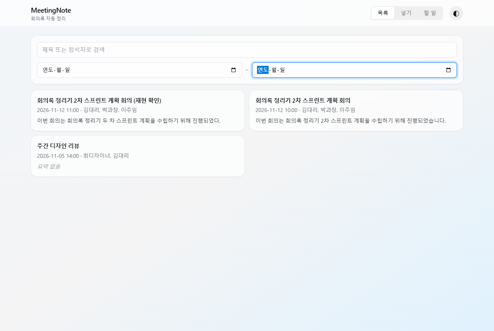 | 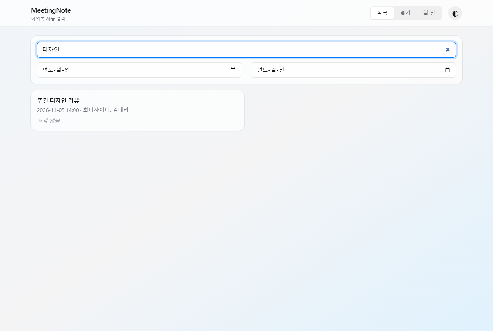 | 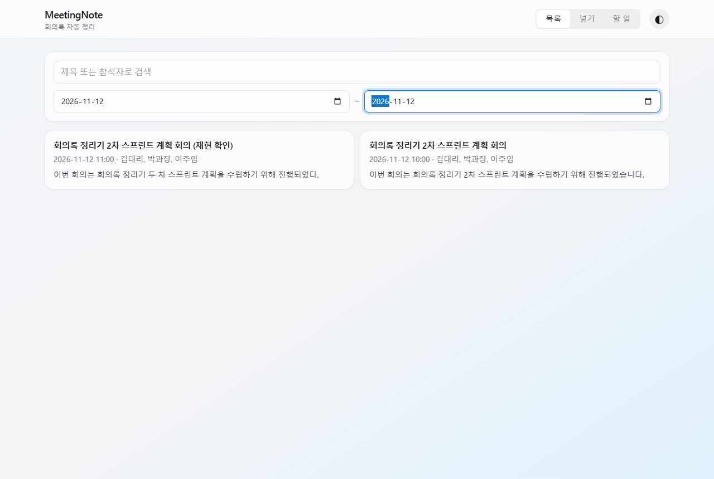 |

### 3. 상세 - 수정 · 삭제

| 상세 창 | 받아쓴 본문 펼치기 |
|---|---|
| 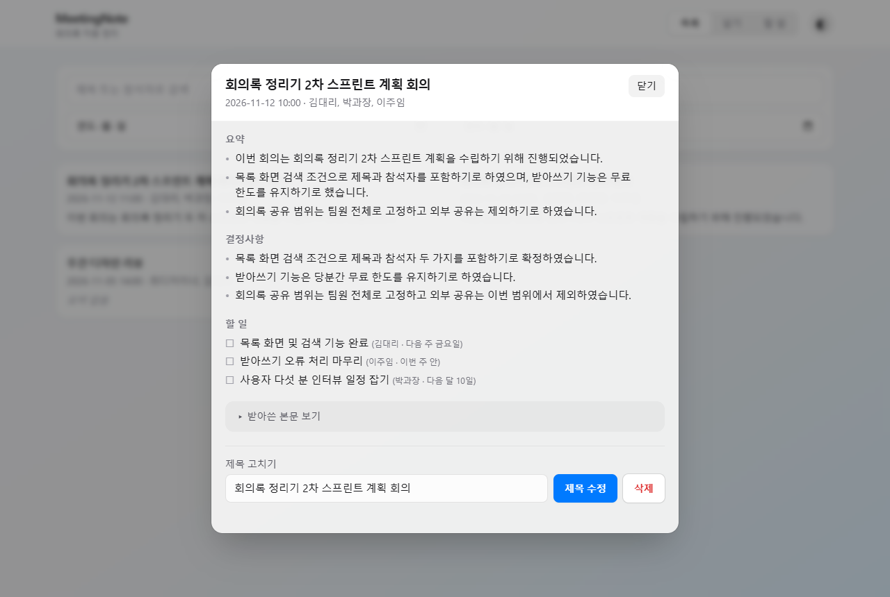 | 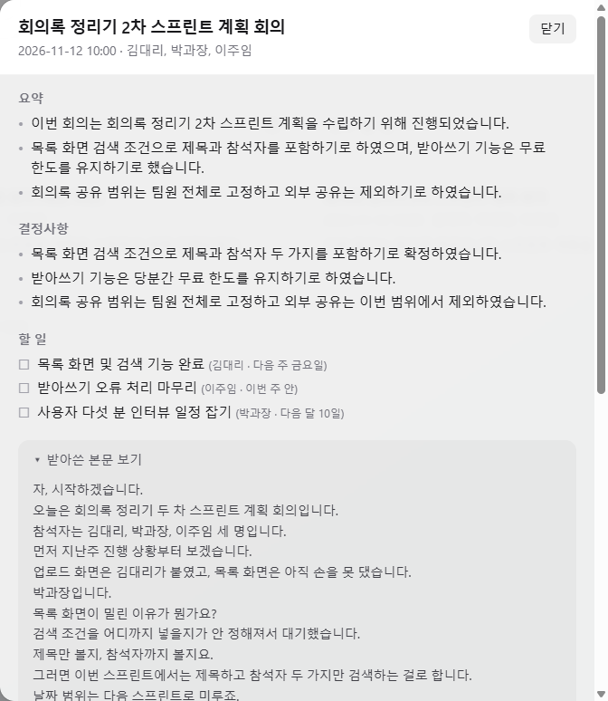 |

| 제목 수정 | 삭제는 두 번 눌러야 |
|---|---|
| 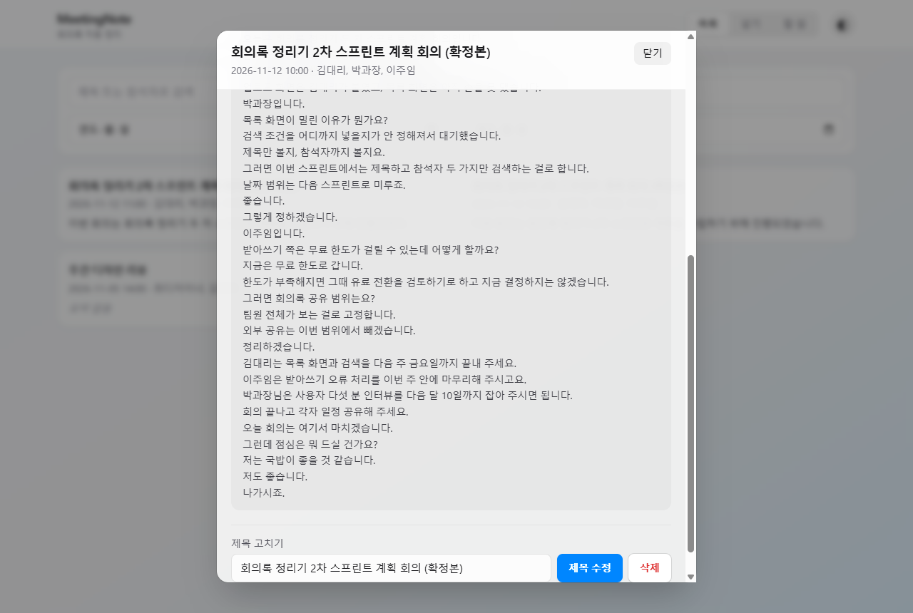 | 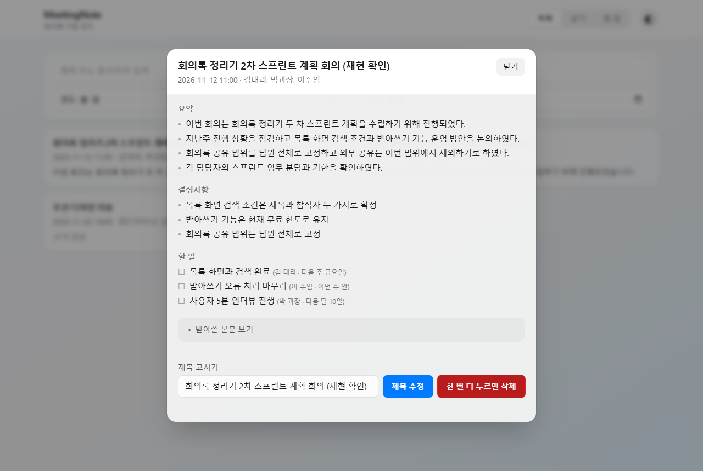 |

### 4. 할 일 · 다크 테마

| 할 일 표 | 다크 테마 |
|---|---|
| 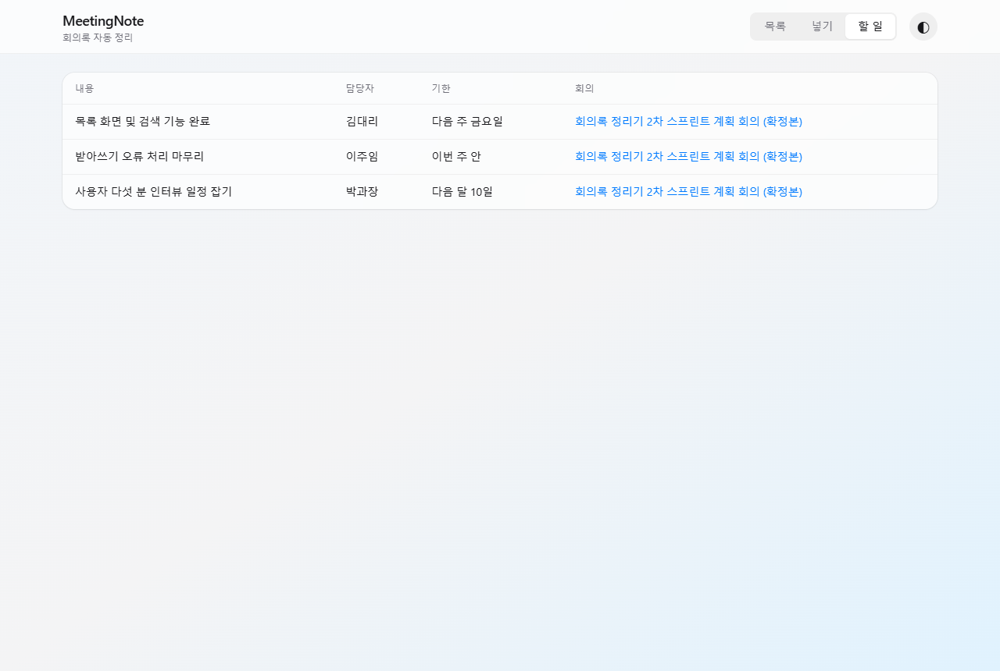 | 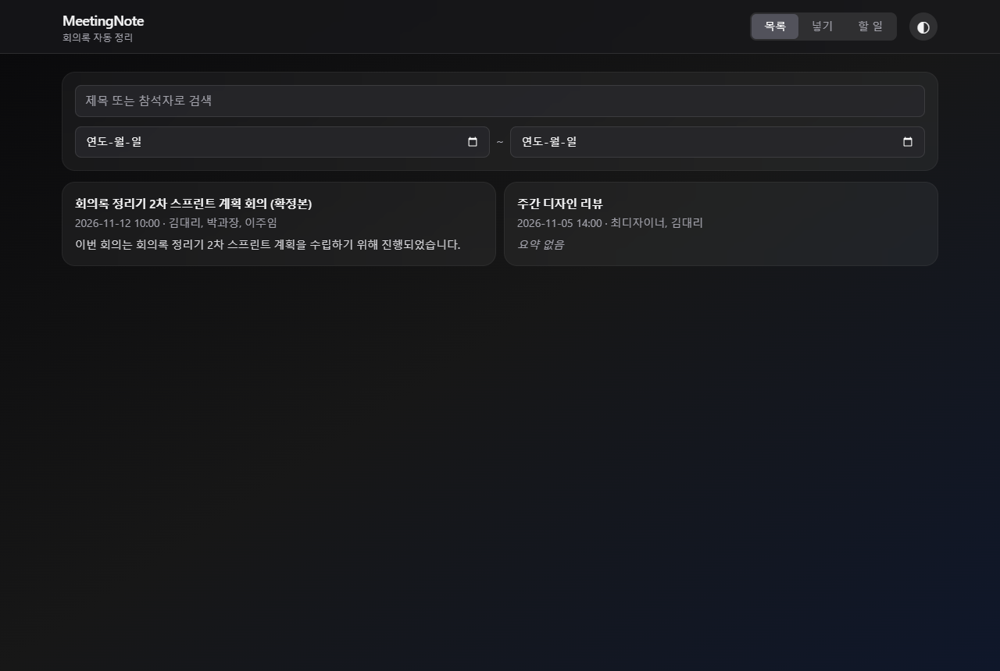 |

### 5. 모바일 (360px)

| 목록 | 넣기 | 할 일 (표만 가로 스크롤) | 상세 |
|---|---|---|---|
| 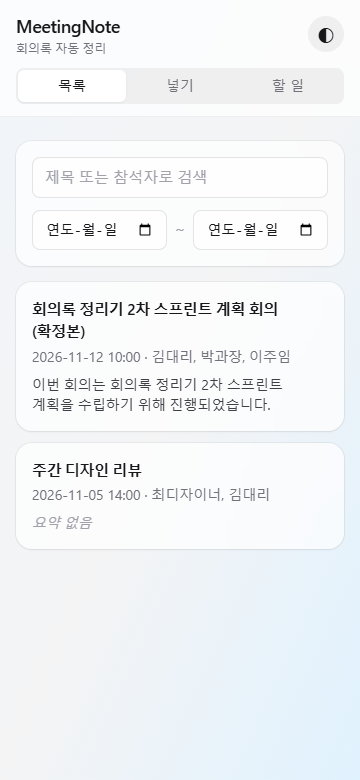 | 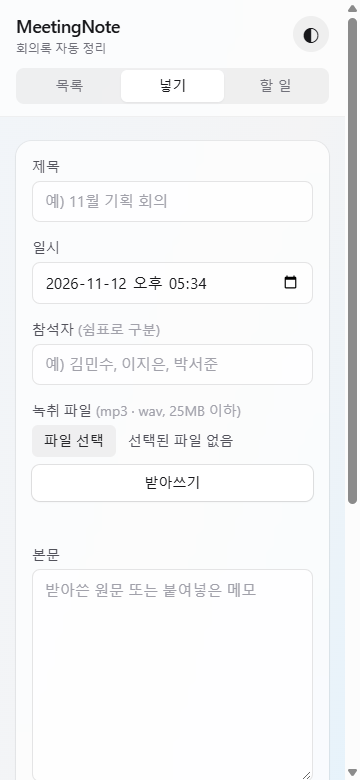 | 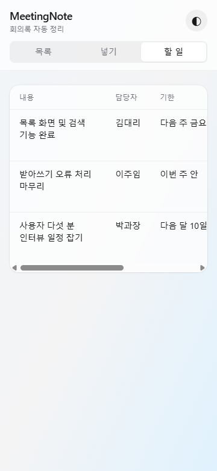 | 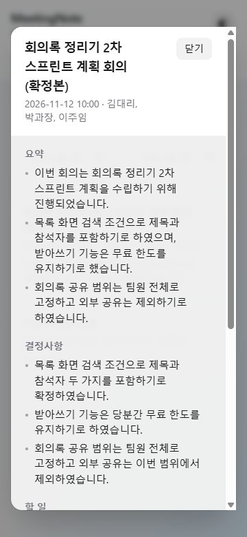 |

---

## 구조

프론트는 백엔드가 **같은 오리진**에서 제공합니다. 빌드 도구 없이 `index.html` · `app.js` 두 파일뿐입니다.

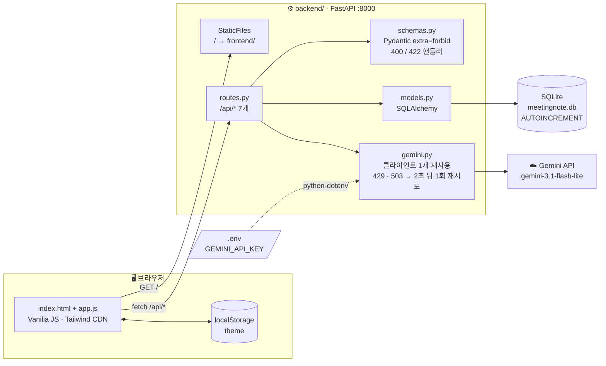
```mermaid
flowchart LR
    subgraph Browser["🖥️ 브라우저"]
        UI["index.html + app.js<br/>Vanilla JS · Tailwind CDN"]
        LS[("localStorage<br/>theme")]
    end

    subgraph Server["⚙️ backend/ · FastAPI :8000"]
        Static["StaticFiles<br/>/ → frontend/"]
        Routes["routes.py<br/>/api/* 7개"]
        Valid["schemas.py<br/>Pydantic extra=forbid<br/>400 / 422 핸들러"]
        Gem["gemini.py<br/>클라이언트 1개 재사용<br/>429 · 503 → 2초 뒤 1회 재시도"]
        ORM["models.py<br/>SQLAlchemy"]
    end

    DB[("SQLite<br/>meetingnote.db<br/>AUTOINCREMENT")]
    Gemini["☁️ Gemini API<br/>gemini-3.1-flash-lite"]
    Env[/".env<br/>GEMINI_API_KEY"/]

    UI -- "GET /" --> Static
    UI -- "fetch /api/*" --> Routes
    UI <--> LS
    Routes --> Valid
    Routes --> ORM --> DB
    Routes --> Gem --> Gemini
    Env -. "python-dotenv" .-> Gem
```

---

## 동작 흐름 (시퀀스)

### 녹취 업로드 → 받아쓰기 → 세 갈래 정리

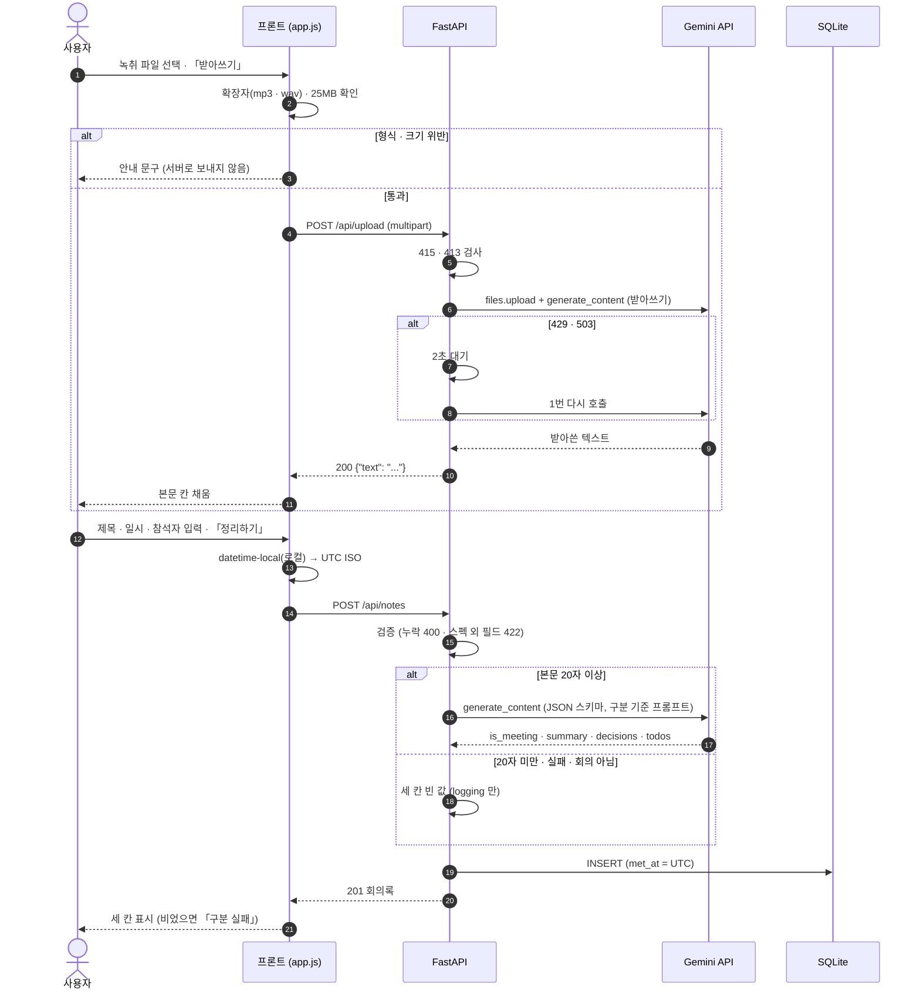
```mermaid
sequenceDiagram
    autonumber
    actor U as 사용자
    participant F as 프론트 (app.js)
    participant A as FastAPI
    participant G as Gemini API
    participant D as SQLite

    U->>F: 녹취 파일 선택 · 「받아쓰기」
    F->>F: 확장자(mp3 · wav) · 25MB 확인
    alt 형식 · 크기 위반
        F-->>U: 안내 문구 (서버로 보내지 않음)
    else 통과
        F->>A: POST /api/upload (multipart)
        A->>A: 415 · 413 검사
        A->>G: files.upload + generate_content (받아쓰기)
        alt 429 · 503
            A->>A: 2초 대기
            A->>G: 1번 다시 호출
        end
        G-->>A: 받아쓴 텍스트
        A-->>F: 200 {"text": "..."}
        F-->>U: 본문 칸 채움
    end

    U->>F: 제목 · 일시 · 참석자 입력 · 「정리하기」
    F->>F: datetime-local(로컬) → UTC ISO
    F->>A: POST /api/notes
    A->>A: 검증 (누락 400 · 스펙 외 필드 422)
    alt 본문 20자 이상
        A->>G: generate_content (JSON 스키마, 구분 기준 프롬프트)
        G-->>A: is_meeting · summary · decisions · todos
    else 20자 미만 · 실패 · 회의 아님
        A->>A: 세 칸 빈 값 (logging 만)
    end
    A->>D: INSERT (met_at = UTC)
    A-->>F: 201 회의록
    F-->>U: 세 칸 표시 (비었으면 「구분 실패」)
```

### 목록 · 검색 · 상세 · 수정 · 삭제

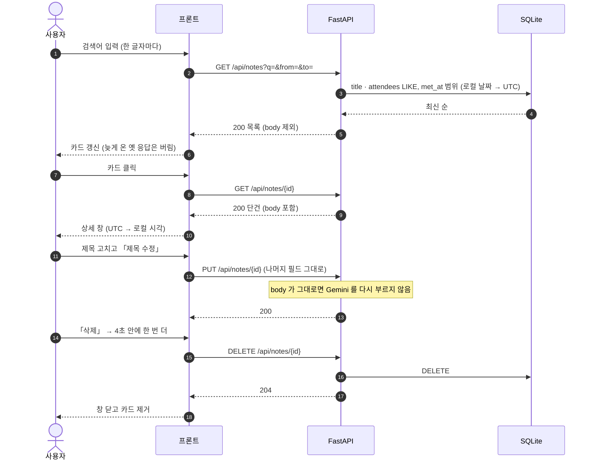
```mermaid
sequenceDiagram
    autonumber
    actor U as 사용자
    participant F as 프론트
    participant A as FastAPI
    participant D as SQLite

    U->>F: 검색어 입력 (한 글자마다)
    F->>A: GET /api/notes?q=&from=&to=
    A->>D: title · attendees LIKE, met_at 범위 (로컬 날짜 → UTC)
    D-->>A: 최신 순
    A-->>F: 200 목록 (body 제외)
    F-->>U: 카드 갱신 (늦게 온 옛 응답은 버림)

    U->>F: 카드 클릭
    F->>A: GET /api/notes/{id}
    A-->>F: 200 단건 (body 포함)
    F-->>U: 상세 창 (UTC → 로컬 시각)

    U->>F: 제목 고치고 「제목 수정」
    F->>A: PUT /api/notes/{id} (나머지 필드 그대로)
    Note over A: body 가 그대로면 Gemini 를 다시 부르지 않음
    A-->>F: 200

    U->>F: 「삭제」 → 4초 안에 한 번 더
    F->>A: DELETE /api/notes/{id}
    A->>D: DELETE
    A-->>F: 204
    F-->>U: 창 닫고 카드 제거
```

---

## 데이터 모델

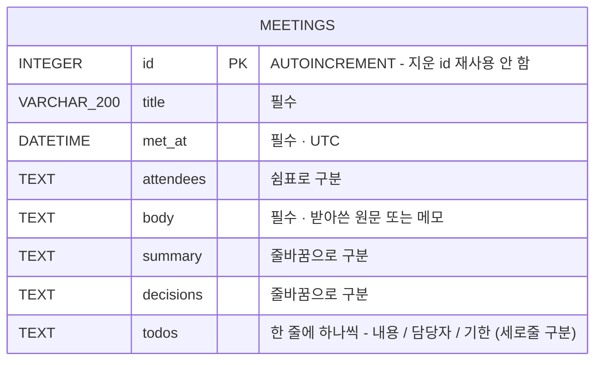
```mermaid
erDiagram
    MEETINGS {
        INTEGER id PK "AUTOINCREMENT - 지운 id 재사용 안 함"
        VARCHAR_200 title "필수"
        DATETIME met_at "필수 · UTC"
        TEXT attendees "쉼표로 구분"
        TEXT body "필수 · 받아쓴 원문 또는 메모"
        TEXT summary "줄바꿈으로 구분"
        TEXT decisions "줄바꿈으로 구분"
        TEXT todos "한 줄에 하나씩 - 내용 / 담당자 / 기한 (세로줄 구분)"
    }
```

`GET /api/todos` 는 `todos` 칸을 줄 단위로 풀어 `what / who / when / note_id / note_title` 로 돌려줍니다. 기한은 「다음 주 금요일」처럼 **말한 그대로** 둡니다.

---

## REST API

모든 경로는 `/api/` 로 시작합니다. 서버를 띄운 뒤 <http://localhost:8000/docs> 에서 Swagger 로 직접 눌러 볼 수 있습니다.

| 메서드 | 경로 | 성공 | 설명 |
|---|---|---|---|
| `POST` | `/api/notes` | 201 | 저장하며 세 갈래 구분까지 |
| `GET` | `/api/notes` | 200 | 목록 (`q` 제목 · 참석자, `from` · `to` 날짜). `body` 제외 |
| `GET` | `/api/notes/{id}` | 200 | 단건 (`body` 포함) |
| `PUT` | `/api/notes/{id}` | 200 | 수정 (`body` 가 바뀔 때만 재구분) |
| `DELETE` | `/api/notes/{id}` | 204 | 삭제 |
| `GET` | `/api/todos` | 200 | 할 일만 모아 보기 (회의 날짜 오래된 순) |
| `POST` | `/api/upload` | 200 | 녹취 파일 → `{"text": ...}` |

| 상황 | 응답 |
|---|---|
| `title` · `met_at` · `body` 누락 / 형식 오류 | **400** |
| 없는 id | **404** |
| 스펙 외 필드 | **422** |
| mp3 · wav 아님 | **415** |
| 25MB 초과 | **413** |
| 받아쓰기 외부 호출 실패 | **502** |

<details>
<summary>📸 Swagger 테스트 캡처 보기</summary>

| 업로드 200 | 저장 201 (세 갈래) |
|---|---|
| 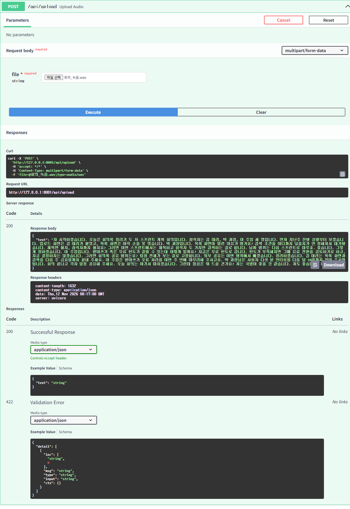 | 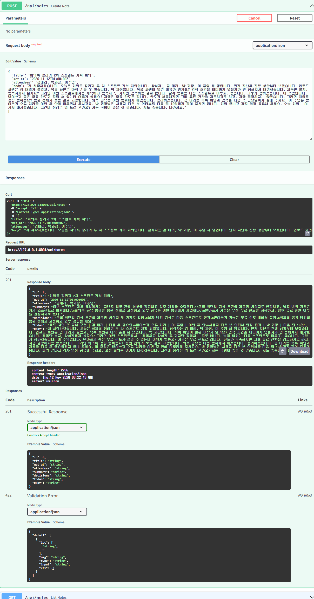 |

| 검색 q | 할 일 |
|---|---|
| 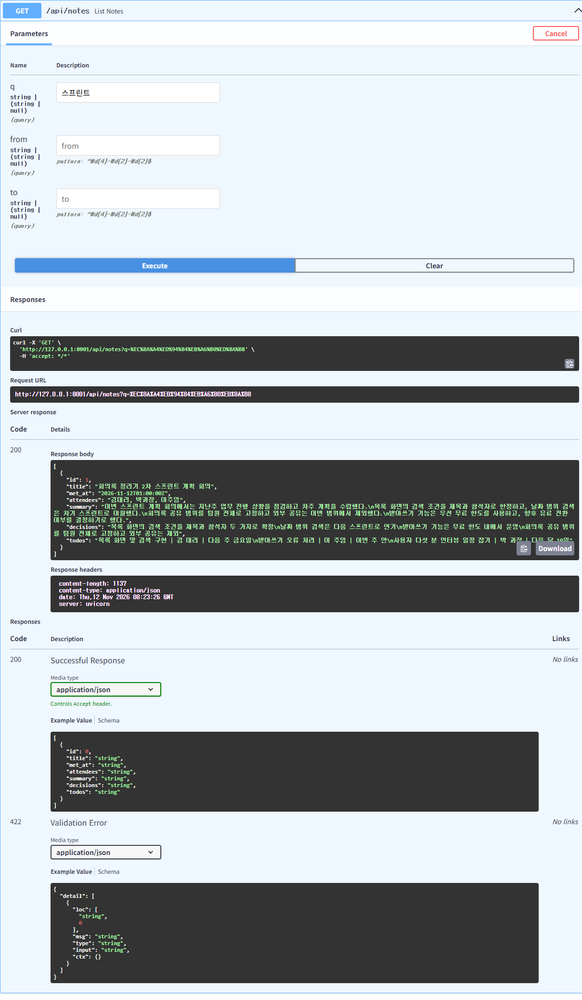 | 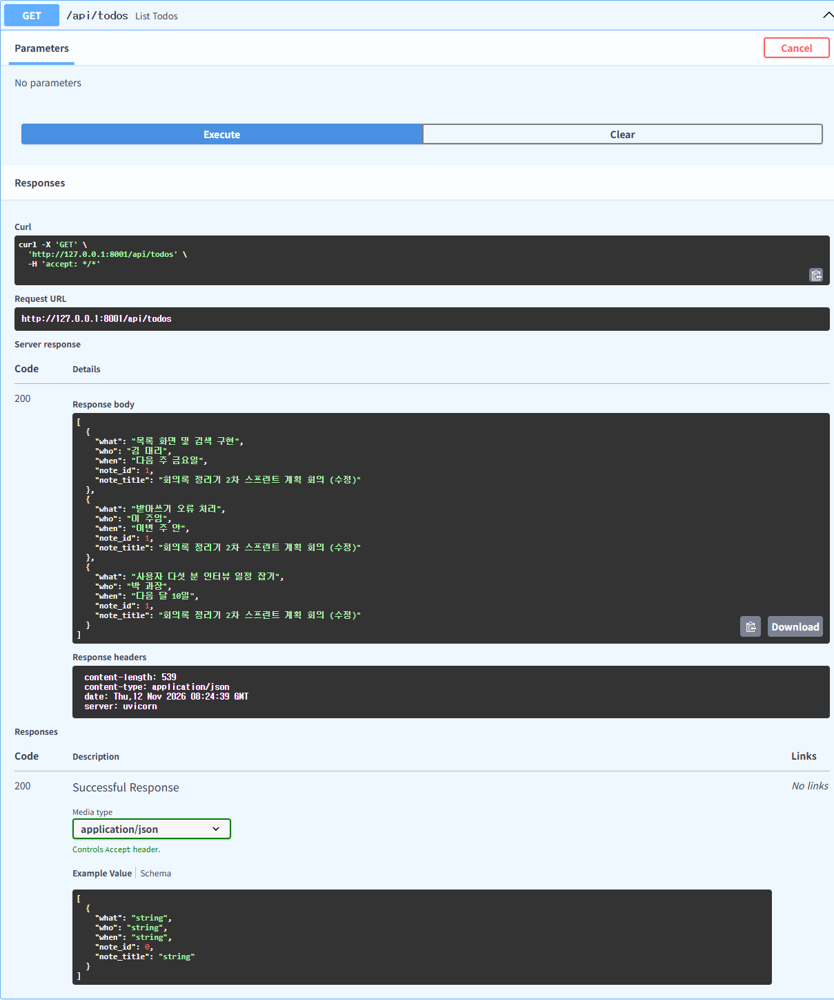 |

| title 누락 400 | 스펙 외 필드 422 |
|---|---|
| 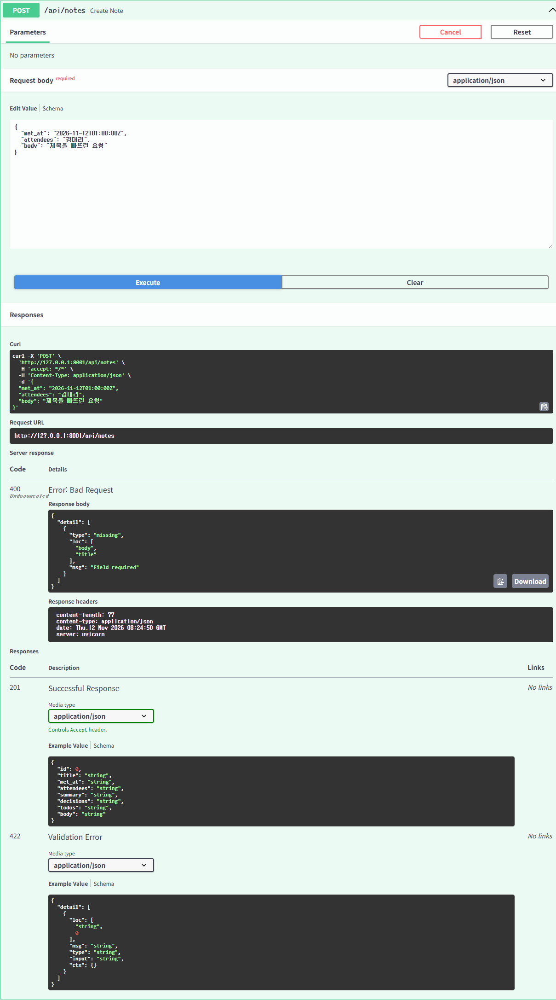 | 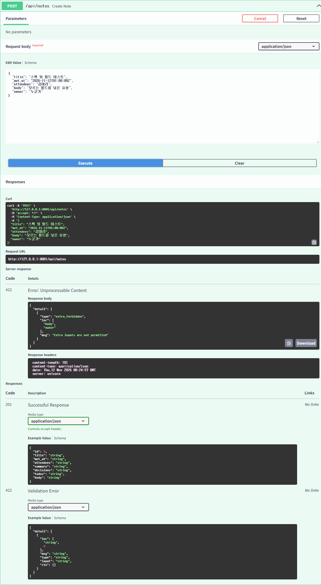 |

| mp4 415 | 30MB 413 |
|---|---|
|  | 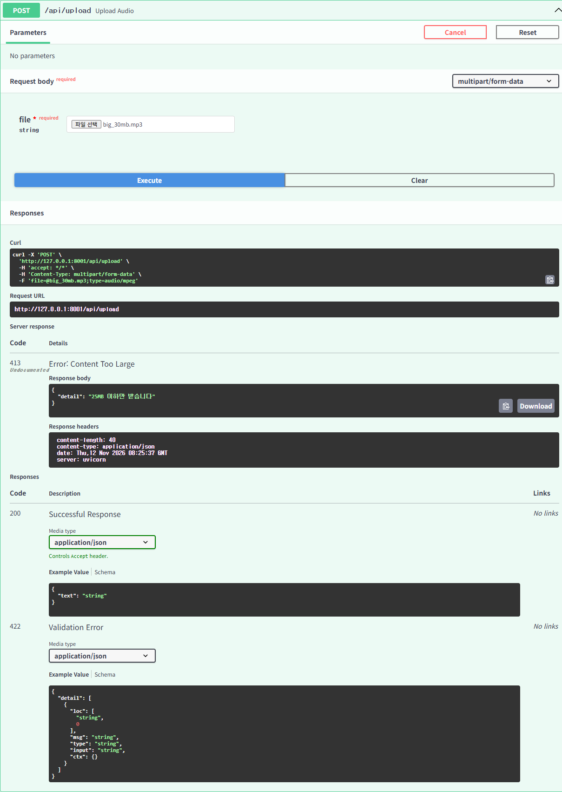 |

</details>

---

## 빠른 시작

**필요한 것**: Python 3.11 이상, Gemini API 키

```bash
# 1. 키 설정 (.env 는 커밋되지 않습니다)
cp .env.example .env
#    GEMINI_API_KEY=발급받은_키

# 2. 가상환경 · 의존성
cd backend
python -m venv .venv
.venv\Scripts\activate          # macOS · Linux: source .venv/bin/activate
pip install -r requirements.txt

# 3. 실행 (포트 8000 고정)
uvicorn main:app --port 8000
```

브라우저에서 <http://localhost:8000> 을 엽니다. `file://` 로 직접 열지 마세요 (API 와 같은 오리진이어야 합니다).

---

## 테스트

```bash
cd backend
python -m pytest -q
```

- **28개** (테스트 매트릭스 13케이스 + 단계별 검증 15개)
- 받아쓰기 · 세 갈래 구분은 **실제 Gemini 를 부릅니다** (대역 없음). 호출 사이는 1초씩 띄웁니다
- 테스트 DB 는 임시 폴더에 따로 만들어 개발 DB 를 건드리지 않습니다

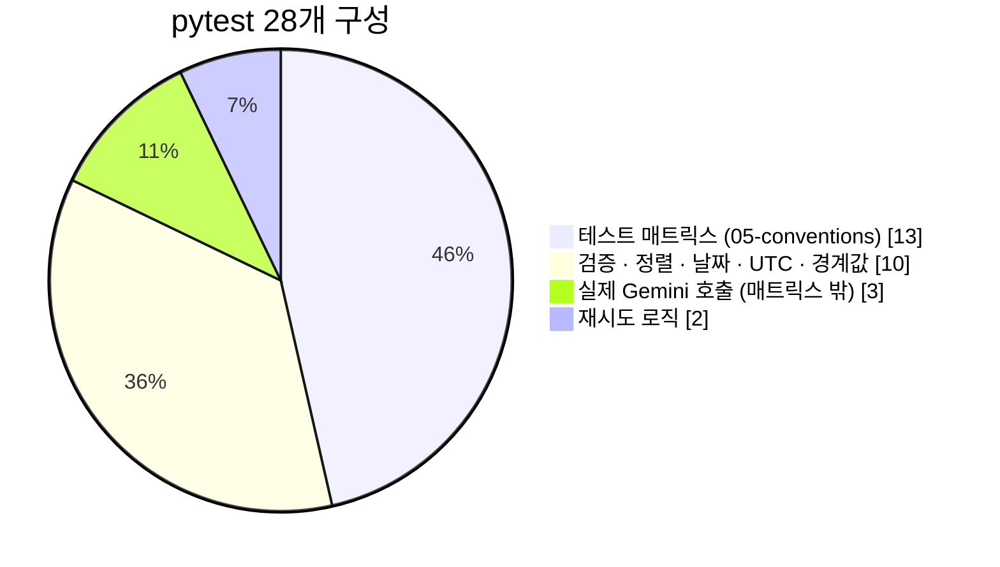
```mermaid
pie showData
    title pytest 28개 구성
    "테스트 매트릭스 (05-conventions)" : 13
    "검증 · 정렬 · 날짜 · UTC · 경계값" : 10
    "실제 Gemini 호출 (매트릭스 밖)" : 3
    "재시도 로직" : 2
```

### 사용자 테스트 보고서

| 보고서 | 내용 |
|---|---|
| [API_테스트_보고서.docx](test-report/API_테스트_보고서.docx) | Swagger 로 API 7개 · 16단계, 실제 녹음 받아쓰기 |
| [프론트엔드_테스트_보고서.docx](test-report/프론트엔드_테스트_보고서.docx) | Playwright 로 화면 4종 · 22단계, 360px, id 대조 |

---

## 폴더 구조

```
meetingnote/
├── backend/                 FastAPI + SQLite
│   ├── main.py              앱 · 400/422 예외 핸들러 · 프론트 제공
│   ├── routes.py            REST API 7개
│   ├── schemas.py           요청 · 응답 스키마 (extra=forbid)
│   ├── models.py            Meeting 모델 8필드
│   ├── gemini.py            받아쓰기 · 세 갈래 구분 · 재시도
│   ├── database.py          엔진 · 세션
│   ├── config.py            .env 읽기 · 상수
│   ├── requirements.txt     의존성 8개 (고정)
│   └── tests/               pytest 28개 + 녹취 샘플
├── frontend/
│   ├── index.html           화면 4종 마크업
│   └── app.js               상태 · DOM 갱신 · API 호출
├── docs/                    설계 문서 6종 + 화면구성.pdf
├── test-report/             사용자 테스트 보고서 · 캡처
├── CLAUDE.md                작업 규칙
└── .env.example             키 자리 (실제 키는 .env)
```

---

## 문서

작업 전에 이 순서로 읽습니다. 한 문서는 한 가지 질문에만 답합니다 (관심사 분리).

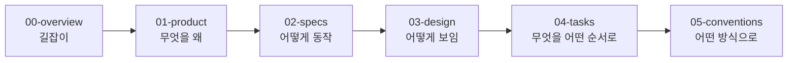
```mermaid
flowchart LR
    O["00-overview<br/>길잡이"] --> P["01-product<br/>무엇을 왜"] --> S["02-specs<br/>어떻게 동작"] --> D["03-design<br/>어떻게 보임"] --> T["04-tasks<br/>무엇을 어떤 순서로"] --> C["05-conventions<br/>어떤 방식으로"]
```

| 문서 | 내용 |
|---|---|
| [00-overview](docs/00-overview.md) | 프로젝트 한 줄 · 문서 지도 · 읽는 순서 |
| [01-product](docs/01-product.md) | 목표 · 페르소나 · MVP 범위 · 성공 기준 |
| [02-specs](docs/02-specs.md) | 모델 · API 7개 · 검증 · 실패 처리 · 구현 결정 |
| [03-design](docs/03-design.md) | 기술 결정 8개 · 요소 id 표 · 의존성 정책 |
| [04-tasks](docs/04-tasks.md) | Phase 1~3 체크리스트 (모두 완료) |
| [05-conventions](docs/05-conventions.md) | 명명 · 금지 6개 · 테스트 매트릭스 · 커밋 규칙 |

### 진행 현황


```mermaid
gantt
    title MVP 진행 (2026-11-12)
    dateFormat HH:mm
    axisFormat %H:%M
    section Phase 1 설계
    CLAUDE.md + docs 6종     :done, p1, 16:19, 16:50
    section Phase 2 백엔드
    API 7개 + 받아쓰기 + pytest :done, p2, 16:55, 17:12
    section Phase 3 프론트
    화면 4종 + API 연결       :done, p3, 17:13, 17:21
    section 사용자 테스트
    Swagger · 화면 테스트 + 보고서 :done, t1, 17:16, 17:40
```
